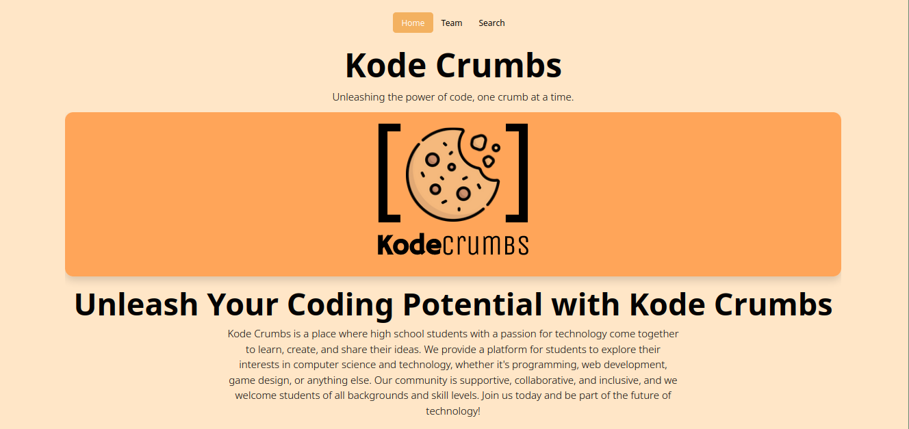

# Kode-Crumb-Site

<!-- Shields -->
[![Contributors][contributors-shield]][contributors-url]
[![Forks][forks-shield]][forks-url]
[![MIT License][license-shield]][license-url]
[][insta-url]
[][gmail-url]

<!-- Logo & Heading  -->

 

  

  <h2 align="center">Kode Crumb</h3>

  

    Kode Crumbs' awesome website repository! 
     Browse the code, make contributions or fork the repository to create your version of the website.

<!-- Contents -->

  
Table of Contents

  <ol>
    <li>
      <a href="#about-the-project">About The Project</a>
      <ul>
        <li><a href="#built-with">Built With</a></li>
      </ul>
    </li>
    <li>
      <a href="#contri-guide">Contributing Guide</a>
      <ul>
        <li><a href="#forking">Forking The Repo</a></li>
        <li><a href="#pr">Pull Requests</a></li>
      </ul>
    </li>
  </ol>

<!-- About -->
## About The Project
 

Kode Crumbs - We are a community for high school coders. Join us on the journey of exploring, learning and building cool things. This is the Kode Crumbs' website repository built using Hugo, a simple, fast, and flexible static site generator.

#### Colour Palette
The website uses a basic color scheme derived off of the logo's hue. Light schemed by default, a dark mode is available consisting of the exchanged foreground and background colours. 

The scheme can be found at `static/css/custom.css`

<!-- Acknowledges libraries/frameworks used in development -->
### Built With
The Following major libraries and frameworks helped bootstrap the project:

* 
* 
* 
* 
* 

<!-- Guide to contribute to the project -->
## Contributing to Kode Crumbs

Thank you for considering contributing to Kode Crumbs! This guide will help you get started with contributing to the project.

### Code of Conduct

Before contributing to the project, please read and abide by our [Code of Conduct](CODE_OF_CONDUCT).

### Issues and Bugs

If you find an issue or bug with the project, please submit a detailed report in the [Issues](https://github.com/KodeCrumbs/kodecrumbs.github.io/issues) section of our GitHub repository. Please be sure to include a clear and concise description of the issue, along with any steps you took to reproduce it.

### Pull Requests

We welcome all contributions, big and small! To submit a contribution, please follow these steps:

1. Fork the project repository.
2. Clone the forked repository to your local machine.
3. Create a new branch for your changes.
4. Make your changes and commit them to your branch.
5. Push your changes to your forked repository.
6. Submit a pull request from your branch to the `main` branch of the project repository.

Please ensure that your code follows the [Hugo coding standards](https://gohugo.io/categories/getting-started/).

### Git Attributes

Please make sure to use the `.gitattributes` file to ignore any files that should not be included in pull requests, such as the workflow file (`hugo.yml`).

<!-- LICENSE -->
## License

Distributed under the MIT License. See `LICENSE` for more information.

## Contact

If you have any questions or concerns, please reach out to us through the [Issues](https://github.com/KodeCrumbs/kodecrumbs.github.io/issues) section of our GitHub repository.

<!-- Markdown Links -->
[license-shield]:https://img.shields.io/static/v1?label=LICENSE&message=MIT&color=blueviolet&style=for-the-badge
[license-url]: [https://github.com/KodeCrumbs/kode-crumbs-hs.github.io/LICENSE](https://github.com/Code-Crumbs-HS/code-crumb-site/blob/main/LICENSE)
[forks-shield]: https://img.shields.io/github/forks/KodeCrumbs/kode-crumbs-hs.github.io?style=for-the-badge
[forks-url]: https://github.com/KodeCrumbs/kode-crumbs-hs.github.io/forks
[contributors-shield]: https://img.shields.io/github/contributors-anon/KodeCrumbs/kode-crumbs-hs.github.io?logoColor=important&style=for-the-badge
[contributors-url]: https://github.com/KodeCrumbs/kode-crumbs-hs.github.io/graphs/contributors
[insta-url]: https://www.instagram.com/kode.crumbs/
[gmail-url]: mailto:codecrumbshs@gmail.com
