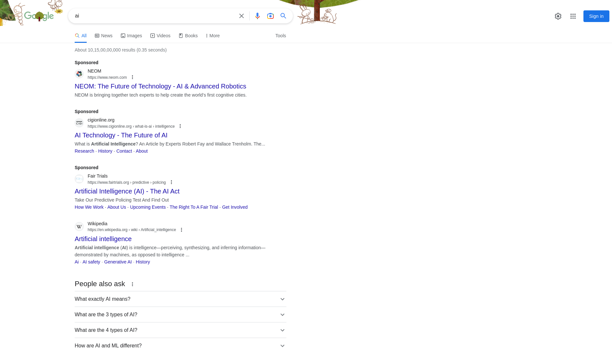
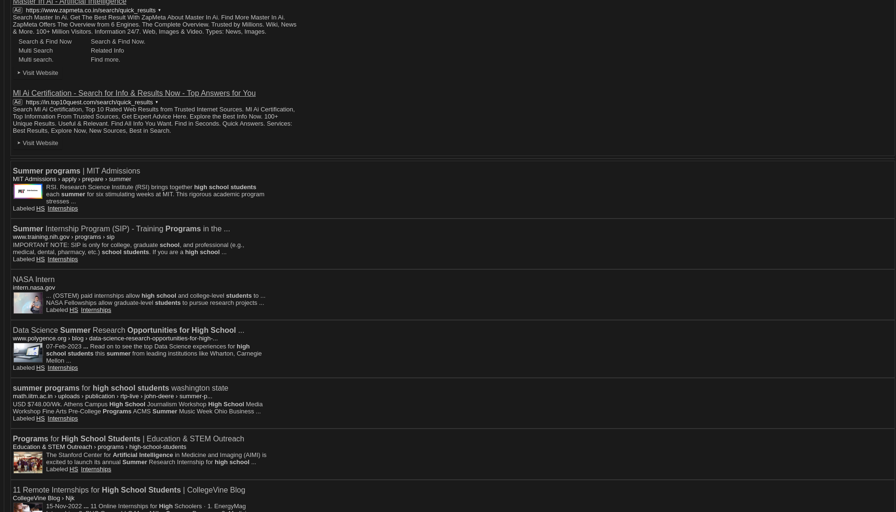

As high schoolers, we are always on the hunt for new opportunities to develop our skills and enhance our resumes. However, the process of finding these opportunities can be incredibly time-consuming and overwhelming. That's where Kode Quest comes in – a custom search engine built by the Kode Crumbs team that is specifically designed to help high schoolers find opportunities catered to them.

## What is Kode Quest?  

Kode Quest is a search engine that searches over Google PSE (Programmable Search Engine) to find opportunities that are perfect for high schoolers. The platform is built with filters and refinements that allow users to easily find opportunities based on their interests, location, and other criteria.

## Why is Kode Quest so Important?

As high schoolers, we are often limited by our resources and experience when it comes to finding opportunities. Traditional job search engines like [LinkedIn](https://linkedin.com/) and [Indeed](https://indeed.com/) are tailored to college students and working professionals, leaving high schoolers at a disadvantage. Kode Quest is a game-changer because it is specifically designed for high schoolers, making it easier to find opportunities that match our interests and skill levels.
Whether you're looking for internships, scholarships, or extracurricular activities, Kode Quest makes it easy to find what you're looking for. With our intuitive interface and powerful search filters, you'll be able to find the perfect opportunities in no time.

But how does Kode Quest compare to other search engines like Google? Let's take a look:

| Feature           | Kode Quest    | Google   |
|-------------------|:-------------:|:------------:|
| Inbuilt Refinements | ✔️           | ❌           |
| Tailored to High Schoolers | ✔️      | ❌           |
| User-friendly interface | ✔️       | ✔️            |
| Relevant Results   | ✔️           | ❌            |
| Accessible on any device | ✔️      | ✔️            |
| Captcha when using Dorks | ✔️       | ❌          |

 

**Result when we search for "AI" on both the engines. (Left is Google, Right is Kode Quest)**

    

        
    

    

        
    

 

As you can see, Kode Quest offers a level of customization and high school-focused results that simply isn't available with other search engines. Plus, by leveraging the power of Google PSE, Kode Quest delivers reliable and accurate results, ensuring that you never miss out on an opportunity again.

So why waste time wading through irrelevant search results? Head to [Kode Quest](https://cse.google.com/cse?cx=4168224e459284430#gsc.tab=0) today and start finding the opportunities that matter most to you.
